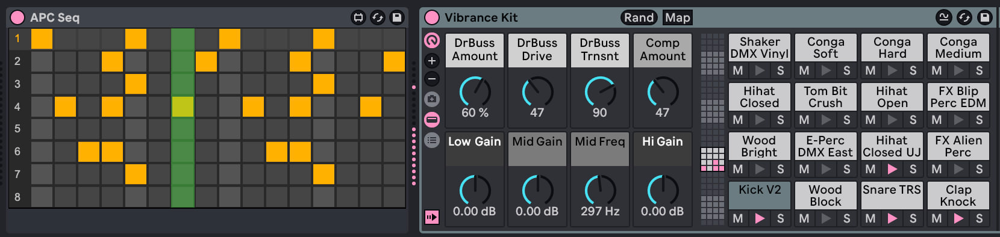

**English** | [Русский](README.ru.md)

# APC Seq for Max for Live

Program drum patterns on the AKAI APC mini mk2 the way you would on a classic drum machine: tap steps on the pad grid, switch drums with the buttons below it, mix with the faders. The sound comes from any Drum Rack you like, and the whole pattern is visible right in Live's device chain.



Prefer a standalone plugin that plays its own samples? See [apc-mini-step-sequencer](https://github.com/om1ji/apc-mini-step-sequencer), the VST3 version.

## What it does

- **16-step patterns for eight drums.** The top two pad rows are one bar of 1/16 steps; each of the eight buttons under the grid shows one drum.
- **Pads light up like a step sequencer should:** gray steps, yellow hits, a green light running along with Live's transport.
- **The pattern on screen.** The device panel shows all eight drums at once; click a cell to toggle a step, click a drum number to show it on the controller.
- **Your own sounds.** APC Seq plays the Drum Rack after it, so you keep Live's samples, effects and choke groups.
- **Faders mix the kit.** Faders 1–8 set the volume of each drum, fader 9 the whole track.
- **Locked to Live's tempo.** Steps follow Live's transport, loops and tempo changes.

## What you need

- AKAI APC mini mk2.
- Ableton Live 12 Suite, or Live 12 Standard with Max for Live. Tested with Live 12.0.5 on macOS.
- Python 3, to build the device from this repository. There is no ready-made download yet.

## Install

1. Download or clone this repository.
2. In a terminal, from the repository folder, run:

   ```bash
   python3 build.py
   ```

   The device appears in Live's browser under **User Library → MIDI Effects → Max MIDI Effect → APC Seq**.

The build script expects Live at `/Applications/Ableton Live 12 Suite.app`. If yours is installed elsewhere or is a different edition, change `TEMPLATE` at the top of [`build.py`](build.py).

## Set up Live

1. Open **Settings → Link, Tempo & MIDI**:
   - in a free **Control Surface** slot choose **MaxForLive**, with Input and Output **APC mini mk2 (Control)**. This is how the device lights the pads;
   - for the input port **APC mini mk2 (Control)** turn **Track** on;
   - if **APC mini mk2** is selected as a Control Surface, set that slot to **None**, otherwise Live repaints the pads.
2. Create a MIDI track. Set **MIDI From** to **APC mini mk2 (Control)** and **Monitor** to **In**.
3. Drag **APC Seq** onto the track, then a **Drum Rack** after it. The first eight Drum Rack pads, C1 to G1, are the eight drums.
4. Press Play and tap the top two pad rows.

## Playing

| Control | What it does |
| --- | --- |
| Top two pad rows | steps 1–8 on the top row, 9–16 on the row below; tap to turn a step on or off |
| Buttons under the grid | pick the drum to edit: button 1 is Drum Rack pad C1, button 8 is G1 |
| Faders 1–8 | volume of drums 1–8; fully up is 0 dB |
| Fader 9 | volume of the whole track |

You can edit steps while Live is playing or stopped. All eight drums play at once, whichever one is shown on the grid. Every hit has the same velocity.

The controller does not tell Live where its faders are until you move them, so a fader takes effect from its first move.

## If something does not work

| What you see | What to do |
| --- | --- |
| Red text in the device: `Выберите Control Surface «MaxForLive» для APC mini mk2 в настройках Live` | the MaxForLive control surface is not set up; follow step 1 of [Set up Live](#set-up-live), then add the device again |
| Pads light up, but tapping them does nothing | the track does not hear the APC: check **Track** on the input port, **MIDI From** and **Monitor In** |
| Grid and lights work, but there is no sound | put a Drum Rack after APC Seq on the same track, with samples on pads C1–G1 |
| Pads flicker or show clip colors | another script is also driving the lights: the APC mini mk2 control surface, or the VST3 version of APC Seq |
| The device says it cannot find `apcseq.js` | the files next to `APC Seq.amxd` are missing; run `python3 build.py` again |

The device writes its messages to the Max window: right-click the device title → **Open Max Window**.

## Limitations

- One bar of 16 steps in 4/4. Longer patterns and other meters are not supported yet.
- The device takes all MIDI on its track, so you cannot also play that Drum Rack from a keyboard through the same track.
- The pattern is stored with the Live set, but reopening a saved project has not been tested yet.
- The right-hand buttons and the lower six pad rows are not used.
- Use either this device or the VST3 version on a controller, not both at once.

## How it works

The internals — data flow, design decisions, building and tests — are in [docs/ARCHITECTURE.md](docs/ARCHITECTURE.md).

## License

[MIT](LICENSE).
