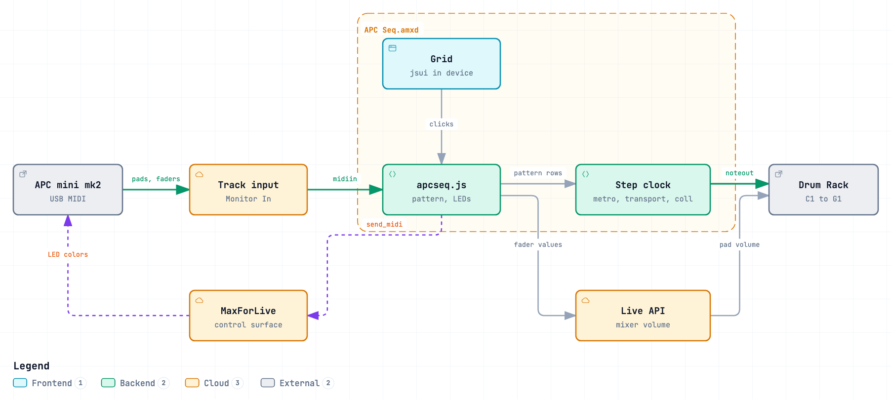

**English** | [Русский](ARCHITECTURE.ru.md)

# How APC Seq works

This document is for anyone who wants to change the device. For installing and playing it, see the [README](../README.md).

<picture>
  <source media="(prefers-color-scheme: dark)" srcset="images/architecture-dark.png">
  
</picture>

## Data flow

- **`apcseq.js`** receives presses and fader moves from `[midiin]` → `[midiparse]`, keeps the pattern, and writes one row per step into a `[coll]`: which of the eight drums sound on that step.
- **The step clock** is plain Max objects: `[metro 16n @quantize 16n]` bangs `[transport]`, its tick count (480 per beat) becomes a step number, `[coll]` returns that step's row, and active drums leave through `[makenote 100 100]` → `[noteout]` as notes 36–43.
- **LEDs** are sent by `apcseq.js` with `send_midi` on the MaxForLive control surface, only for pads that changed.
- **Volumes** are set through the Live API, at most 30 times a second.
- **The pattern** is stored in the Live set as a hidden blob parameter: `[pattr pattern @bindto apcjs]` with `parameter_type` 3.
- **The panel** is a `[jsui]` (`apcseq_ui.js`) that draws the 8 × 16 grid and sends clicks back to `apcseq.js`.

## Why it is built this way

- **Notes are played by Max objects, not by JavaScript.** `[js]` runs in Max's low-priority thread, so notes sent from it would drift. The script only updates `[coll]`; the scheduler-thread chain reads it on each step.
- **Presses arrive through the track's MIDI input.** The first version registered the pads with the MaxForLive surface (`register_midi_control`, `grab_control`) and observed their `value`. In Live 12.0.5 no presses ever reached the device. Reading the track input with `[midiin]` works, and it is what Ableton's own *APC Step Sequencer* factory pack does.
- **LEDs go through the MaxForLive control surface.** A Max for Live device cannot open a hardware MIDI port itself; `send_midi` on a control surface is the supported way to reach the controller's output.
- **Fader updates are coalesced and the volume parameters cached.** The first version looked up the track and the Drum Rack through the Live API on every CC message. Moving all nine faders at once froze Live for seconds. Now only the latest value per fader is applied, every 33 ms, and the parameters are looked up again only when the track's device list changes.
- **The note formula is arithmetic, not `if`.** `[expr]` in Max has no `if()` (Pure Data's does), so `($i2 == 1) * ($i1 + 37) - 1` yields the note for an active drum and `-1` otherwise, which `[sel -1]` drops.
- **The patch is generated by [`build.py`](../build.py),** not saved from the Max editor. A `.amxd` is a small binary header followed by the patcher JSON; keeping the patch as code makes it reviewable in git.
- **The scripts are plain ES5.** Max 8.6, bundled with Live 12.0, runs an old JavaScript engine: `var` and `function` only, no `let`, `const` or arrow functions.

## Repository layout

```
apcseq.js            sequencer logic, controller input, LEDs, volumes, pattern persistence
apcseq_ui.js         jsui: the 8 × 16 grid in the device panel
build.py             generates "APC Seq.amxd" and installs it with the scripts into the User Library
test/apcseq.test.js  logic tests in Node with Max and Live API stubs
docs/diagrams/       archify source and interactive diagram
```

## Building

`build.py` copies the top-level settings of Live's empty *Max MIDI Effect* template, replaces its boxes and patch cords with the ones described in the script, and writes the `.amxd` container: `ampf` header, device type `mmmm` (MIDI effect), an empty `meta` chunk and a `ptch` chunk with the patcher JSON. The template path is `TEMPLATE` at the top of the script.

By default the device goes straight into the User Library; `--out` builds it elsewhere, which is how release archives are made:

```bash
python3 build.py --out "dist/APC Seq"
```

The generated file contains no absolute paths: Max finds the scripts in the device's own folder.

## Testing

```bash
node test/apcseq.test.js
```

It runs `apcseq.js` with stubbed Max and Live API objects and checks the step ↔ pad layout, track selection, step toggling and the rows written to `[coll]`, saving and restoring the pattern, and which Live API parameters the faders set. The patch, timing and the controller are checked by hand in Live.

## Diagrams

The interactive diagram is [`diagrams/architecture.html`](diagrams/architecture.html), built from [`diagrams/architecture.json`](diagrams/architecture.json) with [archify](https://github.com/tt-a1i/archify). The PNGs in `images/` are screenshots of it in the light and dark themes. To regenerate the HTML, from the repository root:

```bash
node <path-to-archify>/bin/archify.mjs deliver architecture \
  docs/diagrams/architecture.json docs/diagrams/architecture.html --quality showcase
```
